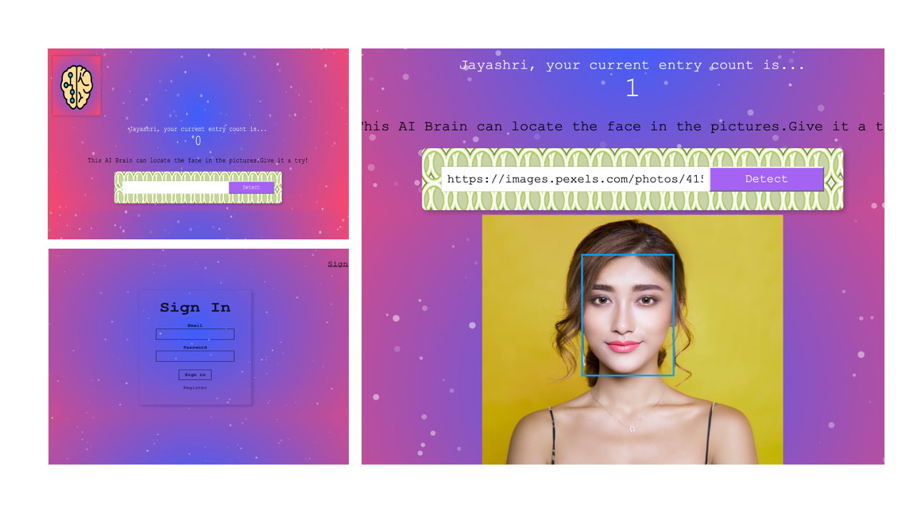

### Face Recognition App

This project was bootstrapped with [Create React App](https://github.com/facebook/create-react-app).

## How to run the repo

1.	Clone this repo
2.	Run npm install
3.	Run npm start
4.	You must add your own API key in the src/App.js file to connect to Clarifai.

### Tools used

## Front-End
*	HTML5
*	CSS3
*	React.js

## APIs
*	Clarifai
*	Facerecognition_App API

## NPM Packages

*	Create-React-App
*	Express
*	Tachyons
*	react-tilt
*	particles.js
*	Bcrypt
*	Postgresql
*	knex
*	cors

The app is Deployed in Heroku

Logo Attribute : http://www.dariusdan.com
